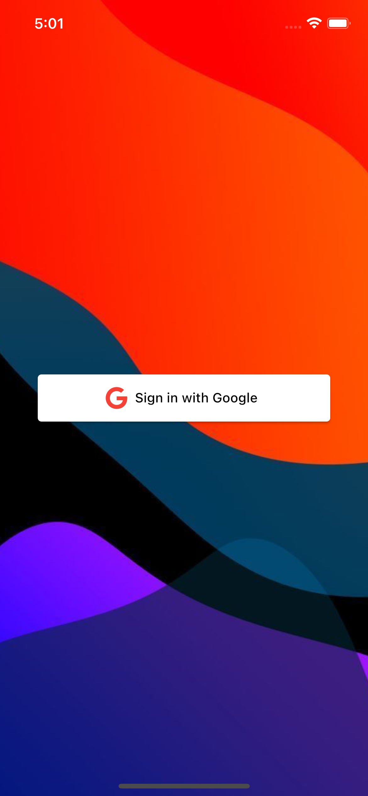
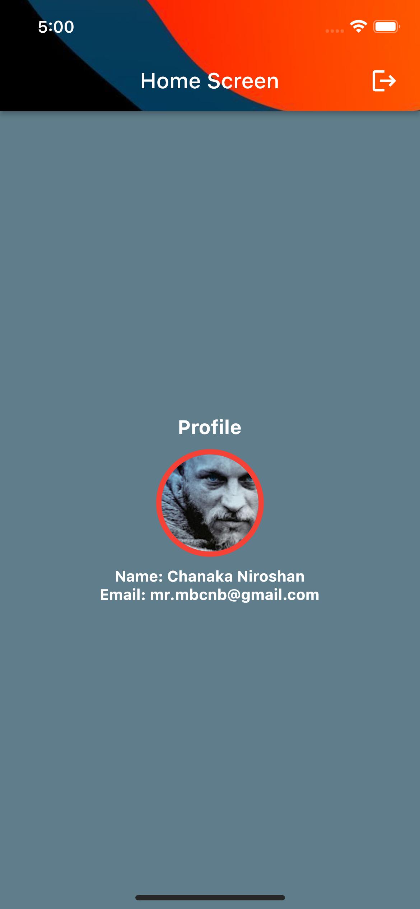

# Flutter - Google Sign in

This project covers, both Anddroid & iOS setup of the flutter-google sign in.

## Getting Started

Following is the step by step workthrough of this project.

- Create a firebase project
- Goto: firebase console > Authentication > Google > Enable 

### Setup android app
- Goto: firebase console > project settings > android 
- Goto: flutter project > android > app > build.gradle > copy application id
- Under register app, put the application id and click 'Register app'
- Download 'google-service.json' and put it inside, 'android > app'
- Copy 'classpath 'com.google.gms:google-services:version' and put it inside, 'project > android > build.gradle > dependencies{}'
- Scroll down the firebase console android app page and copy 'apply plugin: 'com.google.gms.google-services'. Then put it all the way down in the 'project > android > app > build.gradle' file
- In same above file, change the 'defaultConfig{} > minSdkVersion' to 21
- Then add your SHA keys to the firebase project [Setting up SHA Keys](https://developers.google.com/android/guides/client-auth)         

### Setup iOS app
- Open 'ios' folder in XCode, click with 'control' button and select 'Open in XCode'
- Goto: firebase console > project settings > iOS 
- Give 'bundle id', you can find this in XCode >  Runner > General > Bundle identifier
- click 'register' app
- Download and put 'GoogleService-Info.plist' inside 'XCode > iOS > Runner', in that time select 'copy items if needed', 'Create folder references' and 'Runner' file as the target and select finish
- Then delete downloaded file from your download folder to avoid 'GoogleService-Info.plist' file reference errors  
- Then 'Continue to console' in firebase console and close 'XCode'
- Then add following code inside 'iOS > Runner > Info.plist'

`
<key>CFBundleURLTypes</key>
<array>
	<dict>
		<key>CFBundleTypeRole</key>
		<string>Editor</string>
		<key>CFBundleURLSchemes</key>
		<array>
			<string>todo: update this line</string>
		</array>
	</dict>
</array>
`

Reference of the above code: https://pub.dev/packages/google_sign_in

- Then copy 

`
<key>REVERSED_CLIENT_ID</key>
<string>com.googleusercontent.apps.1083940679426-u5cpu445vnig89p67suutlarkcfjp1ap</string>
`

from 'iOS > Runner > GoogleService-Info.plist' and put it inside 'iOS > Runner > Info.plist'

### Coding part
- 01: if you have problems in running project try following commands

<table>
	<tr>
    	<td>rm ios/Podfile</td>
  	</tr>
  	<tr>
    	<td>flutter pub upgrade</td>
  	</tr>
    <tr>
    	<td>flutter pub run</td>
  	</tr>
    <tr>
    	<td>cd ios</td>
  	</tr>
    <tr>
    	<td>pod init</td>
  	</tr>
	<tr>
    	<td>// pod update (fail)</td>
  	</tr>
    <tr>
    	<td>sudo arch -x86_64 gem install ffi</td>
  	</tr>
	<tr>
    	<td>arch -x86_64 pod install</td>
  	</tr>
	<tr>
    	<td>flutter clean</td>
  	</tr>
	<tr>
    	<td>// run the project</td>
  	</tr>
</table>

- 01: import firebase core and initialize firebase in 'main.dart' 
- 02: implement a UI with login button
- 03: setup 'google sign in provider' file
- 04: update 'main.dart' with 'provider'
- 05: update 'onpressed' event of google sign in button
- 06: setup 'page_navigator.dart' page

- 07: if you are facing this kind of error:

`
Restarted application in 497ms.
[VERBOSE-2:ui_dart_state.cc(209)] Unhandled Exception: [core/no-app] No Firebase App '[DEFAULT]' has been created - call Firebase.initializeApp()
#0      MethodChannelFirebase.app (package:firebase_core_platform_interface/src/method_channel/method_channel_firebase.dart:159:5)
#1      Firebase.app (package:firebase_core/src/firebase.dart:53:41)
#2      FirebaseAuth.instance (package:firebase_auth/src/firebase_auth.dart:38:47)
#3      GoogleSignInProvider.googleLogin (package:googlesignup/google_sign_in_provider.dart:24:24)
`

Add 'firebase_core' package to the project
Reference: https://stackoverflow.com/questions/63492211/no-firebase-app-default-has-been-created-call-firebase-initializeapp-in

- 08: Important *remember to add page navigator in 'main.dart'*  
- 09: Implement 'logged screen', how user should see the app after logged in

### Dependencies
- [add 'firebase_auth' package](https://pub.dev/packages/firebase_auth) 
- [add 'google_sign_in' package](https://pub.dev/packages/google_sign_in)
- [add 'firebase_core' package](https://pub.dev/packages/firebase_core)
- [font awosome for google icon](https://pub.dev/packages/font_awesome_flutter)
- [provider package for state management](https://pub.dev/packages/provider)

### References
- [Reference: youtube.com/Johannes Milke](https://www.youtube.com/watch?v=1k-gITZA9CI&t=2s)
- [Reference: youtube.com/CodeX](url)

### Screen Shots
<table>
    <tr>
        <td>  </td>
        <td>  </td>
    </tr>
</table>
